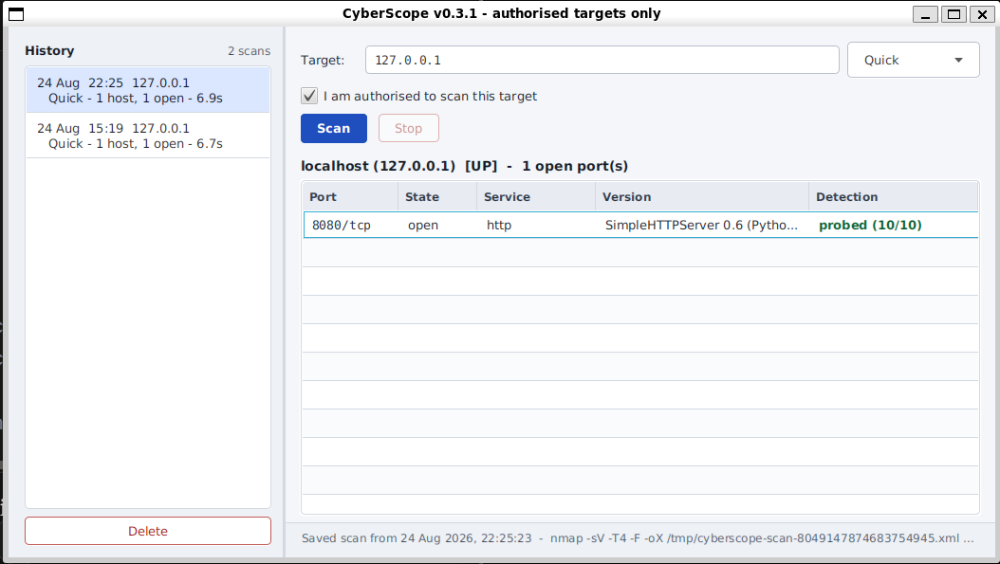

# CyberScope

A desktop security posture analyzer in Java. CyberScope drives Nmap programmatically,
parses its XML output into structured data, stores every scan, and reports what is
actually listening on an authorised target — while keeping track of what it *verified*
versus what it merely *inferred*.



**Status: v0.3.1 — under active development.** Built incrementally; every version is a
small, working, tested slice of the whole. 190 tests currently pass.

---

## What makes it different

Nmap tells you `port 8080 is http`. It will tell you that whether it probed the service
and read a banner back, or whether it looked 8080 up in a table of common ports and
guessed. Those are completely different levels of evidence, and the default output
presents them identically.

Nmap *does* record the difference — `method` and `conf` attributes in its XML — and
almost every tool that consumes Nmap throws them away.

**CyberScope treats that provenance as primary data.** Every result carries how it was
determined and how confident Nmap was; the reports say so; the database keeps it; and
when CVE mapping arrives, only probed results will be eligible to raise a finding.

A guess promoted to a vulnerability finding is how a security report falls apart under
review. This is the layer that stops it.

---

## Quick start

```bash
git clone https://github.com/c00k3r/CyberScope.git
cd CyberScope

# Desktop interface
mvn clean javafx:run

# Command line
mvn -q clean package -DskipTests
mvn -q dependency:copy-dependencies -DoutputDirectory=target/lib
java -cp "target/classes:target/lib/*" com.cyberscope.App 127.0.0.1
```

Requires **JDK 21+**, **Maven 3.9+**, and **Nmap 7.x** on the `PATH`.

> Scan only systems you own or have written authorisation to test. See
> [Authorised use](#authorised-use-only).

---

## What it does today

**Scanning**
- IPv4 addresses, RFC 1123 hostnames, and CIDR ranges up to `/24`
- Two scan profiles (Quick, Standard), with the timeout budget scaled to the number of
  addresses in the range
- Cancellation that actually terminates the Nmap process, not just the UI

**Evidence tracking**
- Every service records `probed` or `table` plus Nmap's confidence value
- CPEs captured for each identified service
- Reports and the UI warn whenever any result in a scan was inferred rather than probed

**History**
- Every scan persisted to SQLite at `~/.cyberscope/cyberscope.db`
- Browse past scans in the GUI, or from the CLI with `--history`, `--show`, `--delete`
- Reopening a saved scan reprints the full report without re-scanning

**Two front ends, one engine**
- The GUI and the CLI share the entire service layer. Nothing below `ui/` imports
  JavaFX — which is what makes that possible, and it is enforced by review.

---

## Why the DETECTION column exists

The obvious assumption is that `-sV` settles it: pass the flag and you get real service
detection. **It doesn't. `-sV` is a request, not a guarantee.**

One `nmap -sV` run against three local ports:

```
port 5432   name=postgresql   method=table    conf=3
port 8080   name=http         method=probed   conf=10
port 9100   name=jetdirect    method=table    conf=3
```

- **8080** was a Python `http.server`. Nmap probed it and matched — `SimpleHTTPServer 0.6
  (Python 3.11.15)`, confidence 10, with a CPE.
- **5432** was a socket emitting random bytes. Nmap probed, couldn't match anything, and
  fell back to the port table. It reports `postgresql`.
- **9100** was *also* a Python `http.server`. Nmap's own `nmap-service-probes` file
  contains `Exclude T:9100-9107` — printer ports, which it refuses to probe because
  sending probe data to a JetDirect port prints pages. So `-sV` never touched it, and it
  reports `jetdirect`.

Two of those three names are wrong, and version detection was enabled for all of them.

Nmap marks the unconfirmed ones with a `?` in terminal output. That `?` is a character in
a text stream, not a field. The moment you consume the XML programmatically — which is
the entire point of a tool like this — you need `method` and `conf` as structured data,
and you need everything downstream to refuse to treat `conf=3` as evidence.

CyberScope surfaces which one you got, in the report, in the table, and in the database.

---

## Architecture

```
 ui/                         JavaFX. The only package that imports javafx.*
  │   CyberScopeApp, ScanView, HistoryPane, ScanTask
  │
  ├──▶ service/              Scanning, parsing, reporting
  │      NmapDetector · NmapCommandBuilder · NmapExecutor
  │      NmapXmlParser · ScanReportFormatter
  │
  ├──▶ repository/           The only package that knows SQL exists
  │      DatabaseManager · ScanRepository        ──▶ SQLite
  │
  └──▶ model/  util/         Shared: Host, Port, Service, ScanType,
                             TargetValidator, ProcessRunner
```

Flow of one scan:

```
target string
   → TargetValidator      allow-list; rejects anything that is not an address
   → NmapCommandBuilder   argument array from a closed enum of profiles
   → NmapExecutor         ProcessBuilder, no shell, hard timeout
   → Nmap                 writes XML to a mode-0600 temp file
   → NmapXmlParser        XXE-hardened DOM + XPath
   → Host / Port / Service
   → ScanRepository       one transaction, three tables
   → report or UI
```

`ui/ScanTask` is the single bridge between JavaFX and the service layer. That constraint
is why the CLI and the GUI share every line of scanning, parsing and storage code.

---

## Security decisions

- **Allow-list target validation.** Only IPv4 addresses, RFC 1123 hostnames, and CIDR
  ranges to `/24`. Alternate IP notations (`2130706433`, `0177.0.0.1`, `127.1`) are
  rejected, as are targets beginning with `-`, which Nmap would read as options such as
  `-iL` or `-oA`.
- **No shell involved.** `ProcessBuilder` receives an argument array, so there is no
  shell to inject into. The real risk is **argument injection**, which the validator
  addresses.
- **A closed set of scan profiles.** Nmap options come from an enum; arbitrary flags
  cannot be requested.
- **XXE-hardened XML parsing.** External entity resolution is disabled and entity
  expansion is capped. `disallow-doctype-decl` is deliberately *not* used, because Nmap
  emits `<!DOCTYPE nmaprun>` and that setting would reject Nmap's own output.
- **Secure temporary files.** Scan XML goes to a `Files.createTempFile` path —
  unpredictable name, atomic creation, mode 0600 — and is deleted on every exit path.
- **No orphaned processes.** Cancelling a scan interrupts the worker thread, which
  unblocks `Process.waitFor`; the kill lives in a `finally` block so the interrupt cannot
  skip past it. Regression-tested by counting `nmap` processes after a cancel.
- **Parameterised SQL.** Every statement is a `PreparedStatement` with bound parameters;
  no value is concatenated into SQL text.
- **Foreign keys actually enforced.** SQLite has foreign key checking *off* by default,
  and the setting is per connection. `PRAGMA foreign_keys = ON` is applied on every
  connection, and a test asserts it — without it, deleting a scan would silently orphan
  its hosts and ports.
- **Authorisation gate.** Scans require explicit confirmation before any packets are
  sent: a checkbox in the GUI, a typed `yes` on the CLI.

---

## Data and privacy

From v0.3.0, CyberScope stores completed scans locally in SQLite.

| | |
|---|---|
| **Location** | `~/.cyberscope/cyberscope.db` |
| **Permissions** | file `0600`, directory `0700` |
| **Contents** | target addresses, hostnames, port states, service versions, CPEs |
| **Transmitted** | nothing — there is no network component beyond the scan itself |

Scan history is a reconnaissance profile of somebody's network, so it is treated as
sensitive by default. Remove one scan with `cyberscope --delete <id>` or the Delete
button; remove everything by deleting the database file. Scan with `--no-save` to record
nothing.

**Known limitation:** CyberScope stores the target string but nothing about the network
path. The same private address (`10.0.0.5`) can be a different machine depending on which
network or VPN you are attached to, and history cannot currently tell those apart.
Recording the egress interface and source address is planned.

---

## Command line

```
Usage: cyberscope [options] <target>
       cyberscope --history [--limit n]
       cyberscope --show <id>
       cyberscope --delete <id>

Scan options:
  -s, --scan-type   quick (default) or standard
  -y, --yes         skip the interactive authorisation prompt
      --no-save     do not record this scan in the history

History options:
  -n, --limit       how many rows --history shows (default 20)
      --db <path>   use a different database file
```

| Exit code | Meaning |
|---|---|
| 0 | success |
| 2 | Nmap not installed |
| 3 | invalid target, argument, or unknown scan id |
| 4 | scan or parse failed |
| 5 | database error |

A storage failure after a successful scan is reported on stderr but does **not** change
the exit code — a script checking `$?` should not be told the scan failed when it didn't.

### Example report

```
==============================================================================
 CyberScope scan report
==============================================================================
 Target      : 127.0.0.1
 Scan type   : Quick - Top 100 ports, service and version detection
 Started     : 2026-08-23 06:46:46 IST
 Duration    : 6.3 s
 Command     : nmap -sV -T4 -F -oX /tmp/cyberscope-scan-...xml 127.0.0.1
==============================================================================

 localhost (127.0.0.1)  [UP]
 1 open port

   PORT      STATE  SERVICE  VERSION                                DETECTION
   --------  -----  -------  -------------------------------------  ----------------
   8080/tcp  open   http     SimpleHTTPServer 0.6 (Python 3.11.15)  probed (conf 10)

==============================================================================
 1 host scanned, 1 up, 1 open port total
==============================================================================

[ok] Saved as scan #1   (cyberscope --show 1)
```

---

## Testing

```bash
mvn clean test
```

190 tests. Coverage includes:

- Target validation, including malformed and deliberately malicious input
- Command construction and the argument-injection cases
- Nmap process execution, timeouts, exit codes, and cancellation
- XML parsing against captured real Nmap output
- Persistence: round trips, transaction rollback, cascade deletes, and the foreign-key
  pragma
- Report formatting, CLI argument handling, and exit codes

Fixtures include an XXE payload and an entity-expansion bomb, and the suite asserts both
are rejected. Several tests exist specifically to pin down bugs that were found and
fixed — each carries a comment saying what it is defending against.

The transaction test forces a mid-save failure by dropping a table, then asserts nothing
was left behind.

---

## Technology

| Component | Version |
|---|---|
| Java | 21+ |
| Maven | 3.9+ |
| JavaFX | 21.0.7 |
| SQLite (sqlite-jdbc) | 3.53.2.1 |
| JUnit | 5 |
| Nmap | 7.x (external) |

No XML or JSON library: parsing uses the JDK's own DOM and XPath, hardened explicitly.
Reporting will use Apache PDFBox when it arrives.

---

## Roadmap

| Version | Capability | Status |
|---|---|---|
| v0.0.x | Scanner foundation: validation, command construction, execution, XML parsing, CLI reporting | Done |
| v0.1.0 | JavaFX interface over the scanning pipeline | Done |
| v0.2.0 | Scan profiles, CIDR ranges, cancellation | Done |
| v0.3.0 | SQLite persistence and scan history | Done |
| v0.3.1 | Visual pass: stylesheet, semantic colour for evidence quality | Done |
| v0.4 | System hardening analyzer, network-context recording | Next |
| v0.5 | CVE mapping from captured CPEs — probed results only | Planned |
| v0.6 | Weighted posture score and dashboard | Planned |
| v0.7+ | Live NVD lookups, PDF assessment reports, native packaging | Planned |

The roadmap changes as the project does.

### Not built yet

Stated plainly, because a security tool that overstates itself is worse than one that
underdelivers:

- **No vulnerability detection.** CyberScope identifies services; it does not yet know
  whether any of them are vulnerable.
- **Unprivileged scans only.** SYN scanning needs root; CyberScope uses TCP connect
  scans.
- **One target per scan.** No queueing, no scheduling, no concurrency across targets.
- **Tested on Linux and WSL2 only.**
- **Single user, no authentication.** It is a local desktop tool, not a service.

---

## Why this project exists

Building a scanner is not the interesting part — Nmap already exists and CyberScope uses
it. The interesting part is everything that happens to a finding *after* it is found:
how confident was it, is it still true next week, and can it be defended in a report.

Each version implements one layer and tests it before the next is added, so that every
engineering and security decision along the way is one I can actually explain:

- Driving an external tool safely from Java, without a shell
- Validating input that becomes a command line
- Handling processes, streams, timeouts and cancellation without leaking either
- Turning tool output into structured data, without trusting the parser
- Persisting security-relevant data with integrity and reasonable file permissions
- Keeping the provenance of a finding attached to the finding

---

## Authorised use only

CyberScope performs **active network scanning**, which sends real packets to real hosts.

Scan only systems you own or have explicit written permission to test. Unauthorised
scanning may be unlawful depending on jurisdiction, including under Sections 43 and 66 of
the Information Technology Act, 2000 (India), and the Computer Fraud and Abuse Act (US).

A VPN changes the source address a target logs. It does not change what is lawful.

Development and testing targets are documented in [SCOPE.md](SCOPE.md).

---

## Licence

MIT — see [LICENSE](LICENSE).
