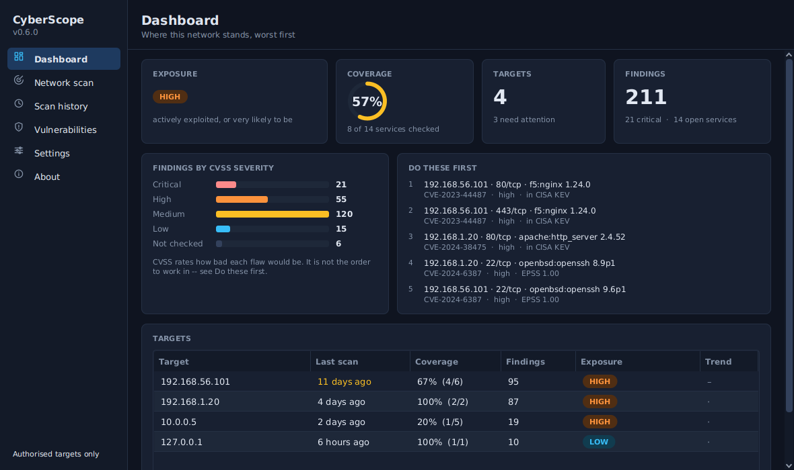

# 🔐 CyberScope

A desktop security scanner that tells you what it actually verified.

Nmap reports a service the same way whether it read a banner or guessed from the port number. CyberScope keeps those apart, matches versions against the NVD corpus, and ranks what it finds by **whether anyone is exploiting it** — not by CVSS.



## 🎯 Why not a single security score

The same machine scored **91/100** and **100/100** in testing. Same host, same nginx — the only difference was which CPE Nmap emitted. `f5:nginx` matches NVD; `igor_sysoev:nginx` matches nothing, so it produced zero findings and a perfect score.

One number cannot separate *nothing is wrong* from *nothing was checked*, and it always rounds toward reassuring. So there are two numbers instead:

- **Exposure** — the worst thing found anywhere, as a band
- **Coverage** — how much of the host that opinion is based on

A CLEAR band at 40% coverage is not a good result, and now it does not look like one.

## 🔥 Why not CVSS

Measured against the real 384,678-CVE index: **47%** of a typical host's findings are rated HIGH or CRITICAL. **1%** appear in CISA's Known Exploited Vulnerabilities catalogue. A field where half the rows say "critical" cannot order a work queue.

Ranking uses KEV membership, ransomware association and EPSS probability. CVSS is a column, not a verdict.

```text
oracle:mysql    73 findings   max EPSS 0.0111   0 in KEV
f5:nginx         2 findings   max EPSS 1.0000   1 in KEV
````

Sorting by count puts the wrong machine first.

## 🚀 Install

Needs Java 21 and Nmap on your PATH.

```bash
git clone https://github.com/c00k3r/CyberScope
cd CyberScope
mvn clean package
mvn javafx:run
```

Build the vulnerability index once (~100 MB of public NVD data, about a minute):

```bash
java -jar target/cyberscope.jar --update-cve-index
```

Then refresh the exploitation feeds daily — KEV and EPSS are 4 MB and take seconds:

```bash
java -jar target/cyberscope.jar --update-exploit-signals
```

Both are also buttons on the Settings page.

## ⚠️ Authorised targets only

Port scanning a machine you do not own or have written permission to test is unlawful in most jurisdictions, including under the IT Act 2000 (India) and the CFAA (US). It is not made lawful by curiosity, by the scan being read-only, or by nothing breaking.

Use it on your own machines, a lab you built, a deliberately vulnerable target, or a system whose owner has authorised the test in writing and in scope. The checkbox in the UI is a prompt, not a permission — there is deliberately no setting to turn it off.

## 🚫 What it is not

Not a vulnerability scanner. It sends no exploit traffic and never confirms a CVE is present and reachable. It matches a version string to a catalogue, which is inference, and says so on every row. A finding is a question to investigate.

## 🏗️ How it is built

```text
ui/  →  service/  →  repository/  →  SQLite
       model/ and util/ are shared and depend on nothing above them
```

557 tests. The boundaries above are enforced by `ArchitectureTest`, not by convention. The stylesheet is linted by `StylesheetTest` — including a check that JavaFX's own parser keeps every rule, after a selector split across two lines made it silently discard 86 of 117 and render half the application in default colours.

Load-bearing logic is mutation-tested: each release, rules are deliberately broken and the suite has to notice. v0.6.0 applied 45 mutations across four parts and killed all of them. Three were survivors first — each one a test that passed for the wrong reason.

```bash
mvn test
```

## 🌐 Data

Scan results stay in a local SQLite file. Nothing about your network is transmitted. The only outbound requests fetch public feeds — NVD, CISA KEV, and EPSS by FIRST.org — and are identical for every user.

## 📄 Licence

MIT. Built by Mrityunjay Guleria.

